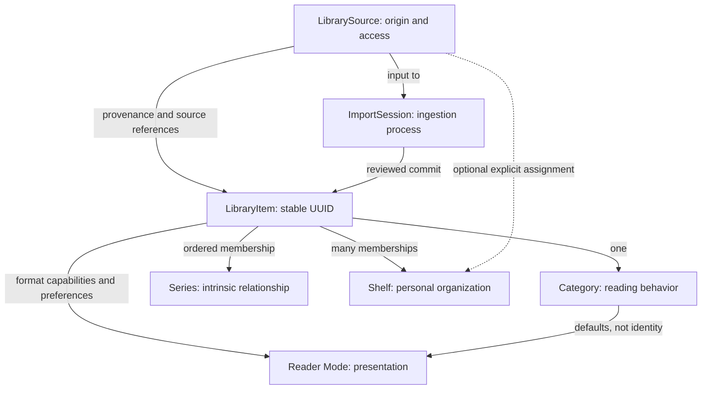

# ShelfOS Architecture

## Implementation status and accepted direction

Phase 1 is accepted ([validation](VALIDATION.md), 2026-09-24): single-file import, Room v2
library/reading state, PDF/CBZ adapters, Readium EPUB integration, the cover-expansion
reader transition and the rest of 1D polish are implemented and validated on both emulators
and physical hardware. Two documented, non-blocking environment limitations remain (an API
24 emulator-specific test flake and an API 37 automated-UI-test tooling gap; see
[VALIDATION](VALIDATION.md)), neither a ShelfOS defect. Do not describe it as a public
release: [Public Demo Readiness](VALIDATION.md) is a separate, later gate.

[PHASE_1_PLAN](PHASE_1_PLAN.md) scopes that first slice. Accepted ADRs 0018–0022
extend the target architecture; they do not claim the new ingestion, Series,
Shelves, Source or Adapted PDF systems exist. The detailed specifications below
own behavior; this document owns their relationships and responsibility boundaries.

## Canonical taxonomy

| Concept | Question | Boundary |
| --- | --- | --- |
| LibrarySource | Where did content come from, and can we access it again? | Durable origin/access, not an import job |
| LibraryItem | What does ShelfOS know about one publication? | Stable identity, metadata and state survive access loss |
| Category | What reading behavior does it need? | BOOK / COMIC / MANGA / DOCUMENT; format still limits capabilities |
| Series | Which publications intrinsically belong together, in what order? | Generic virtual aggregation, never a file merge |
| Shelf | How does this user want to organize publications? | Multiple memberships; not a custom media type |
| Reader Mode | How should this publication be presented? | PDF Adapted / Original where supported |



Favorites is an independent system filter across categories. Source, Series and
Shelf do not determine category. All six concepts remain independent of themes.

| Detailed source of truth | Scope |
| --- | --- |
| [Data ingestion](features/DATA_INGESTION.md) | Sessions, candidates, plans, staging/review/commit and migration |
| [PDF ingestion](features/PDF_INGESTION.md) | Modes, PublicationDocument, SourceMap and mapping limits |
| [Series](features/SERIES.md) | Membership, ordering, progress and virtual omnibus |
| [Shelves](features/SHELVES.md) | Personal organization, pinning and terminology |
| [Library Sources](features/LIBRARY_SOURCES.md) | Provenance, scans, health and reconnection |

## 1. Architecture goals

ShelfOS architecture should prioritize:

- local-first behavior
- maintainability
- offline correctness
- clear reader-engine boundaries
- testability
- input flexibility
- theme extensibility
- gradual growth
- low operational complexity

Avoid premature distributed systems, accounts, and backend dependencies.

## 2. Technology stack

Initial target:

- Kotlin
- Jetpack Compose
- AndroidX
- Coroutines
- Flow / StateFlow
- Room
- Android Storage Access Framework
- Readium Kotlin Toolkit where appropriate
- Gradle
- GitHub Actions for build, unit tests, and lint

Dependency injection may use Hilt or another conventional Android approach if introduced deliberately.

## 3. Initial module strategy

Start with one Android app module.

Do not begin with a large multi-module Gradle graph.

Use package-level architectural boundaries first:

```text
app/
└── src/main/java/<package>/
    ├── core/
    │   ├── database/
    │   ├── files/
    │   ├── network/
    │   ├── designsystem/
    │   ├── theme/
    │   ├── input/
    │   ├── reader/
    │   └── entitlement/
    │
    ├── data/
    │   ├── library/
    │   ├── metadata/
    │   ├── annotations/
    │   ├── preferences/
    │   └── entitlement/
    │
    ├── domain/
    │   ├── importing/
    │   ├── library/
    │   ├── reader/
    │   └── annotations/
    │
    └── feature/
        ├── home/
        ├── library/
        ├── importing/
        ├── reader/
        ├── notes/
        ├── shelves/
        └── settings/
```

Split into Gradle modules only when compile times, ownership, reuse, or dependency isolation justify it.

## 4. Layering

### UI layer

Jetpack Compose screens and reusable components.

Responsibilities:

- render state
- emit user actions
- manage focus behavior
- accessibility semantics
- navigation presentation

Avoid direct database or network calls from composables.

### Presentation / state holders

Screen-level ViewModels.

Responsibilities:

- expose immutable UI state
- consume UI actions
- coordinate repositories / use cases
- handle loading/error state

Prefer unidirectional data flow.

### Domain layer

Optional business-use-case layer.

Use where logic is meaningful enough to deserve explicit representation.

Examples:

- `ImportLibraryItem`
- `ClassifyPublication`
- `ResolveMetadata`
- `OpenLibraryItem`
- `SaveReadingProgress`
- `ToggleFavorite`
- `CreateAnnotation`

Do not create one-line use cases solely to satisfy a pattern.

### Data layer

Repositories provide stable interfaces over:

- Room
- file access
- metadata providers
- reader state
- preferences
- entitlements

## 5. Core data model

Conceptual model:

```text
LibraryItem
├── id
├── source
│   ├── sourceId (LibrarySource UUID)
│   ├── platformReference (Android URI at the edge)
│   ├── sourceRelativePath?
│   ├── sourceFingerprint?
│   ├── sourceModifiedAt?
│   ├── mimeType
│   ├── format
│   ├── originalFileName
│   └── checksum?
├── metadata
│   ├── title
│   ├── authors
│   ├── description
│   ├── isbn
│   ├── publisher
│   ├── publicationDate
│   └── language
├── category
│   ├── BOOK
│   ├── COMIC
│   ├── MANGA
│   └── DOCUMENT
├── favorite
├── cover
├── readingState
├── presentationPreferences (including preferred PDF mode)
├── seriesMemberships
├── shelfMemberships
├── createdAt
└── updatedAt
```

The exact Room schema may normalize some of these concerns.

## 6. Persistence and conceptual models

Room v1 persisted appearance only. The Phase 1 working tree adds library items,
reading state and reader preferences in v2; it does not implement the full model
above. Extend through tested, non-destructive migrations, not speculative tables.

| Concept | Responsibility and eventual data |
| --- | --- |
| LibrarySource | UUID, name/type/location descriptor, health, capabilities, last scan, recursive/category hint, optional Shelf mapping and scan policy |
| ImportSession | Ingestion ID, source references, status/timestamps and discovered/analyzed/staged/committed/review/skipped/failed counts |
| ImportCandidate / StagedItem | Uncommitted source, format, proposed metadata/category/Series/order/Shelves, duplicates, PDF summary, warnings and review state |
| ImportPlan | Candidates, detected Series, suggested Shelves, duplicate groups, unresolved items and warnings |
| SourceScan | Source ID, start/end, discovered/added/changed/moved/missing/failed results |
| Series / SeriesMembership | Intrinsic group metadata/cover and ordered stable item references with volume/issue/range/date/type evidence |
| Shelf | Manual/Smart organization, memberships or later rules, pinning, presentation and sorting preferences |
| PublicationDocument / SourceMap | Derived semantic chapters/blocks and confidence-bearing source page/bounds/text-range mappings tied to a source revision |

LibraryItem source provenance is separate from source access and platform identity.
Bookmarks, annotations, covers, metadata overrides, reading sessions and later ink
remain separate concerns as their milestones need them. Exact tables, cardinalities
and serialized schemas are not frozen by this conceptual inventory.

## 7. Source access and durability

Android adapters use SAF document/tree URIs and persistable user-scoped grants;
domain identity uses stable ShelfOS UUIDs. No assumed raw filesystem paths, broad
storage access, private app sandbox access or DRM bypass. References are default;
explicit managed copies preserve originals and form a managed LibrarySource.

Access can disappear through a move, deletion, revoked grant or disconnected
provider/storage. Preserve the LibraryItem and its metadata, annotations, progress,
Series and Shelves. Rescans produce reviewable additive changes, never destructive
mirroring. Changed publications need revision-aware locator/SourceMap review.
Details, health vocabulary and disconnect/reconnect flows belong to
[Library Sources](features/LIBRARY_SOURCES.md).

## 8. Ingestion architecture

The common flow is Import Source → Discovery → Staging → Local Analysis →
Organization → Import Review → Commit → ShelfOS Library → Background Enrichment.
Add Files, Add Folder, Add Series and Import Library share these boundaries.
[DATA_INGESTION](features/DATA_INGESTION.md) owns detailed semantics and recovery.
Import-source adapters include document selections, folder trees and the future
`ZipArchiveSource`; the latter safely enumerates a multi-publication archive and
stages ordinary candidates. It is distinct from the CBZ publication adapter.

| Conceptual responsibility | Boundary |
| --- | --- |
| ImportCoordinator | Advances sessions/checkpoints and coordinates cancellation/commit; does not parse every format |
| DiscoveryService | Enumerates authorized selections/trees and safe archive entries through source adapters |
| ImportStagingRepository | Persists candidates, review decisions and resumable session state |
| ImportAnalyzer | Bounded format/embedded metadata/local evidence analysis |
| OrganizationEngine | Proposes category, Series and Shelf organization with user overrides |
| DuplicateDetector | Progressive evidence and reviewable duplicate groups |
| SeriesDetector | Combines embedded/filename/folder/source evidence with confidence |
| PdfAnalyzer | PDF capabilities/confidence and deferred mode recommendations |
| MetadataEnrichmentService | Optional post-commit provider enrichment with provenance |
| LibrarySourceRepository | Durable origin definitions, capabilities, access health and provenance |
| SourceScanner | Traverses authorized Sources and records scan results |
| SourceReconciliationService | Compares scan evidence, proposes relinks/changes and preserves stable identities |
| Archive access utility | Performs bounded, traversal-safe entry access shared where appropriate; does not decide whether a container is a CBZ publication, generic library ZIP or ShelfOS backup |

These are responsibilities, not a demand for one class per name or extra Gradle
modules. Avoid a giant ImportManager. UI consumes state and review actions through
ViewModels/repositories; source/platform/provider details stay behind adapters.
Bulk import needs durable checkpoints, bounded batches and isolated per-file errors.
Online enrichment and expensive PDF reconstruction never gate local commit/reading.
For generic ZIP library import, `ImportCoordinator` commits each accepted candidate
as an independent managed publication. Original archives remain untouched, arbitrary
nested ZIPs do not recurse implicitly, and a bad entry is isolated from safe siblings.

## 9. Media classification

Public categories:

```text
BOOK
COMIC
MANGA
DOCUMENT
```

Automatic classification is a suggestion.

The user may override it.

Comic and Manga may share rendering infrastructure while retaining separate user-facing defaults.

## 10. Reader abstraction

The rest of ShelfOS should not be tightly coupled to Readium.

Define a ShelfOS-owned abstraction.

Conceptual interface:

```text
ReaderEngine
- supports(item)
- open(item)
- close()
- goTo(locator)
- next()
- previous()
- search(query)
- getProgress()
- getCurrentLocator()
```

Specialized capability interfaces may be preferable to one giant interface.

Potential implementations:

- `EpubReaderEngine`
- `PdfReaderEngine`
- `ImageSequenceReaderEngine`
- later `DocxReaderEngine`
- later Adapted PDF adapter over `PublicationDocument` and `SourceMap`

## 11. Reader/content mapping

```text
BOOK
├── EPUB → EpubReaderEngine
└── PDF  → Original PDF adapter or future Adapted PDF adapter

COMIC
├── CBZ/ZIP container → ImageSequenceReaderEngine
├── future CBR/RAR container → ImageSequenceReaderEngine
└── PDF  → PdfReaderEngine with comic presentation

MANGA
├── CBZ/ZIP container → ImageSequenceReaderEngine + RTL defaults
├── future CBR/RAR container → ImageSequenceReaderEngine + RTL defaults
└── PDF  → PdfReaderEngine + RTL-aware presentation where possible

DOCUMENT
└── PDF  → Original PDF adapter or future Adapted PDF adapter where supported
```

## 12. Input architecture

Screens must consume semantic commands, not raw device-specific events.

Concept:

```text
Raw Input
├── touch
├── keyboard
├── gamepad
└── stylus later
      ↓
InputMapper
      ↓
ShelfCommand / ReaderCommand
      ↓
Feature logic
```

Examples:

```text
NEXT_PAGE
PREVIOUS_PAGE
OPEN_MENU
CLOSE_MENU
NEXT_CHAPTER
PREVIOUS_CHAPTER
TOGGLE_BOOKMARK
ZOOM_IN
ZOOM_OUT
SCROLL_UP
SCROLL_DOWN
```

## 13. Theme architecture

Do not implement themes as isolated color swaps.

Conceptual theme contract:

```text
ShelfTheme
├── colors
├── typography
├── shapes
├── elevations/surfaces
├── focusStyle
├── motion
├── optional sounds
├── icon treatment
└── library presentation hints
```

Free themes:

- Classic
- Dark
- Retro Apple UI (working/internal name)
- Retro Apple UI Dark (working/internal name)
- Paper / Vintage Library

This list follows accepted ADR-0012, which supersedes the earlier Night/Aqua naming.

Future premium:

- PageStation

Themes must not compromise accessibility or basic reader clarity.

## 14. Metadata precedence

Manual user input always wins.

Suggested precedence:

```text
USER
> EMBEDDED
> EXACT_EXTERNAL_MATCH
> INFERRED_EXTERNAL_MATCH
> GENERATED
```

Metadata fields may independently have different sources.

Do not overwrite user-edited fields during refresh.

## 15. Cover precedence

Suggested:

```text
USER_SELECTED
> EMBEDDED
> ONLINE_MATCH
> FIRST_PAGE
> GENERATED
```

Generated covers should still look intentional and fit the active ShelfOS design language.

## 16. Annotation model

Text-based annotation concept:

```text
Annotation
├── id
├── libraryItemId
├── locator
├── selectedText
├── type
│   ├── HIGHLIGHT
│   ├── UNDERLINE
│   └── NOTE
├── color/style
├── body
├── createdAt
└── updatedAt
```

Bookmarks may be separate entities.

Future ink annotations should store page/content-relative geometry rather than raw screen coordinates.

## 17. Entitlement architecture

Early versions:

```text
Entitlement = FREE
```

No billing dependency required.

Later:

```text
EntitlementRepository
├── GooglePlayEntitlementRepository
└── optional verified backend implementation later
```

Features query a centralized access policy.

Avoid scattered `if (premium)` logic.

Concept:

```text
FeatureAccess.canUse(Feature.PAGESTATION_THEME)
```

## 18. Backend policy

No backend is required for the prototype.

A future backend may be justified for:

- stronger purchase verification
- optional sync
- remote metadata proxying if rate limits require it

Core reading must not depend on it.

The governing boundary is **offline-complete, online-enhanced**. Core processing should
approach zero marginal infrastructure cost per user: favor local OCR, PDF analysis,
indexing, search, database, notes, organization and reader work. A backend is a deliberate
future infrastructure decision, not the default answer to an extractable client secret.

Default online enrichment should use public/no-key services or authentication designed
for installed clients. Never embed secret provider credentials in the APK. Optional
BYOK credentials remain local where practical. Provider data is cached only where its
current licensing and terms permit; no provider is assumed to grant permanent storage.

## 19. Error model

Use explicit domain errors where useful.

Examples:

- unsupported format
- source unavailable
- permission lost
- corrupt archive
- invalid publication
- metadata lookup unavailable
- cover lookup failed

Do not collapse every failure into a generic "Something went wrong."

## 20. Testing priorities

Prioritize tests around:

- media classification
- metadata precedence
- favorite/category behavior
- import logic
- progress persistence
- input mapping
- theme registry
- reader-engine selection
- source-unavailable behavior
- Room migrations once schema stabilizes

UI tests later for high-value navigation paths.

## 21. Adaptive layout architecture

ShelfOS must not assume a fixed portrait-phone viewport.

UI decisions should respond to:

- current window dimensions
- window size class
- orientation
- fold posture where available
- hinge/occlusion geometry where relevant
- multi-window state

Compact layouts may use bottom navigation and single-pane screens.

Expanded layouts may use:

- navigation rails
- list-detail
- supporting panes
- larger adaptive grids
- two-page reader presentation

Reader state must survive fold/unfold and resizing.

Do not identify foldable behavior by manufacturer/model checks.

## 22. Cross-platform boundary

Android implementation details remain Android-native.

Future iOS should reuse product semantics and portable models, not Android UI/runtime code.

Portable concepts should include stable identifiers and serializable forms for:

- metadata
- annotations
- bookmarks
- shelves
- tags
- progress

Platform-specific source URIs/URLs are adapters and must not become the identity of a LibraryItem.
## Metadata enrichment architecture

Metadata enrichment is a first-class data-layer concern.

Suggested boundary:

```text
MetadataEnrichmentService
├── EmbeddedMetadataProvider
├── IdentifierDetector
├── FilenameInferenceProvider
├── OpenLibraryProvider
├── GoogleBooksProvider
└── future media-specific providers
```

The UI must not call providers directly.

Repository/domain flow:

```text
UI
 ↓
ViewModel
 ↓
EnrichMetadata / RefreshMetadata use case
 ↓
MetadataRepository
 ↓
MetadataEnrichmentService
 ↓
Providers
```

Persist provenance so manual overrides survive refresh.

Candidate objects should include:

- resolved fields
- provider
- identifiers
- confidence
- cover candidates

Core reading remains functional when every external provider is unavailable.

See `docs/features/METADATA_ENRICHMENT.md`.

## Library presentation architecture

Library presentation should expose stable semantic state independent of theme.

Example screen state:

```text
LibraryUiState
├── activeCategory
├── continueReading
├── items
├── focusedItemId
├── selectedItemDetails
├── viewMode
├── sortMode
└── loading/error state
```

The theme renders this state but does not redefine what it means.

Expanded layouts may derive a persistent detail pane from `focusedItemId` / `selectedItemDetails`.

Compact layouts navigate to a details destination instead.

## Visual references

Visual mockups are supporting artifacts.

Agents and implementation code should follow written design specifications first, then use reference images for:

- proportion
- density
- hierarchy
- visual tone
- interaction intent

Do not reverse-engineer literal pixel values from AI-generated references.

## Phase 0 implementation

See [ADR-0016](adr/0016-phase-zero-foundation.md) for the implemented boundary.
`ShelfApplication` owns a manual `AppContainer`; UI receives ViewModels backed by
repositories. `RoomThemeRepository` persists the selected theme. Library content
was an in-memory set of original demo fixtures. This describes the validated Phase 0
baseline; Phase 1 replaces those fixtures with persisted publications.
Theme tokens centralize colors, typography, shapes, spacing, surfaces, focus,
motion and icons. Navigation destinations and category meanings are shared.

## Phase 1 implementation

Responsibilities follow the [Phase 1 plan](PHASE_1_PLAN.md#3-architecture-and-data) table.

| Concern | Implementation |
| --- | --- |
| Import port | `domain.importing.PublicationImporter` (prepare/discard) with pure archive classification, duplicate and category policies; `core.files.PublicationFiles` implements it for Android documents |
| Import ownership | A preparation (possible private copy and grant) has one owner at a time: the preparing job, the review, the save, then the library. Only abandoned work is discarded; work the library references never is. `domain.importing.ImportLeases`, shared by the process, records which sources unfinished imports hold: a grant is released only when no library item or other import depends on it. Future durable owners such as Library Sources join that check |
| Archive access | `core.files.SeekableZip` reads the granted descriptor with positional reads. Shared-storage descriptors cannot be reopened by path (including `/proc/self/fd`), so `java.util.zip.ZipFile` is not used |
| Error model | `domain.library.PublicationProblem` distinguishes permission loss, unavailable source, unsupported format/layout, protection, damage, empty archives, size limits and storage; only access problems mark an item unavailable |
| Reader sessions | Fixed-layout and EPUB ViewModels own their sessions and close them when cleared; positions are written through a conflated application-scope writer so the latest page survives leaving the reader |
| Preferences | Explicit per-title and global layers; an Appearance change records only the fields it changed, and direction is always per-title |
| Startup maintenance | `AppContainer.sourceMaintenance` removes interrupted partial copies, releases unreferenced read grants and marks items without access unavailable; imports wait for it |
| Private copies | Referenced by file name; removal never deletes them, Settings → Storage deletes unreferenced copies after confirmation |

## Reader coordination and portable backups

Series coordination opens individual reader sessions and preserves each member
locator; it never merges files. PDF modes use best-effort SourceMap positioning
and annotation mapping, with Original always preserved. EPUB keeps its structured
format. See [Reader](features/READER.md), [Series](features/SERIES.md) and
[PDF ingestion](features/PDF_INGESTION.md).

Future backups include stable item/Source/Series/Shelf identities, user overrides,
metadata, permitted covers, progress, annotations/bookmarks, member ordering, Shelf
rules and preferences. Android grants do not transfer to iOS or a new Android device.
Reconnection uses newly granted platform references plus fingerprints/identifiers;
see [backup contract](features/LIBRARY_SOURCES.md#backup-and-device-reconnection).

## Implementation gaps against accepted direction

The existing single-item sourceUri/managedPath model is an interim implementation,
not a durable LibrarySource or ImportSession. It needs provenance/access separation
and resumable staging before bulk/folder claims. Removal is now non-destructive for
private copies (explicit Settings cleanup only); the private copy lives in app storage
rather than the user-visible managed Source the accepted contract prefers, which remains
Source-foundation work. The global destination is Shelves; no Collection names remain
in code ([terminology](features/SHELVES.md#terminology-and-category-boundary)).
